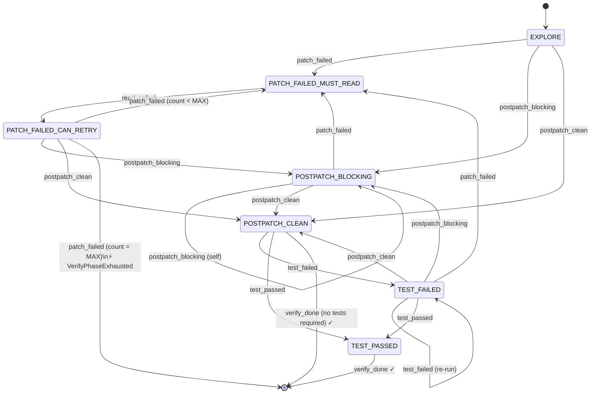

# Verify Phase State Machine — Design Spec

**Date:** 2026-05-20
**Worktree:** `feat-agentic-planning`

---

## Problem

The tool-loop verify phase is governed by five scattered boolean flags in `tools/loop.py`
(`_patch_attempted`, `_postpatch_clean`, `_verify_done`, `_must_read_before_patch`,
`_patch_fail_count`). This creates two failure modes:

1. **Model drift.** Small models are never explicitly told their current verify-phase state.
   They infer it from implicit cues (available tools, error messages) and frequently make wrong
   decisions — emitting patches when they should read, calling `verify_done` before tests pass,
   re-applying the same broken patch in a loop.

2. **Loop amplification.** Without hard enforcement, a model in the wrong state burns through
   the full tool-call budget on degenerate patterns. A 61-iteration / 65,580-token loop has been
   observed in production.

---

## Goals

- Replace the five flags with a single `VerifyPhaseStateMachine` that owns all verify-phase state.
- Tell the model its current state explicitly in the system prompt each turn (model clarity).
- Hard-enforce tool availability per state by removing absent tools from the JSON schema — the
  model cannot call what it cannot see.
- Clear the `emit_patch` dedup cache on every state transition so fresh patches are always allowed
  after context changes.

## Non-goals

- Changing the patch engine, `PostPatchAnalyzer`, or validation runner.
- Modifying the explore phase (before the first patch attempt in a step).
- Adding new tool types.

---

## Design

### States

```python
class VerifyPhaseState(str, Enum):
    EXPLORE                = "EXPLORE"
    PATCH_FAILED_MUST_READ = "PATCH_FAILED_MUST_READ"
    PATCH_FAILED_CAN_RETRY = "PATCH_FAILED_CAN_RETRY"
    POSTPATCH_BLOCKING     = "POSTPATCH_BLOCKING"
    POSTPATCH_CLEAN        = "POSTPATCH_CLEAN"
    TEST_FAILED            = "TEST_FAILED"
    TEST_PASSED            = "TEST_PASSED"
```

| State | Meaning |
|---|---|
| `EXPLORE` | Initial state. No patch applied yet. Model locates code and emits first patch. |
| `PATCH_FAILED_MUST_READ` | Last patch failed. Model must call `read_file` or `search_code` before retrying. |
| `PATCH_FAILED_CAN_RETRY` | Model has read after a patch failure. May now emit a corrected patch. |
| `POSTPATCH_BLOCKING` | Patch applied. `py_compile` or `mypy` reported blocking errors. Must fix before running tests. |
| `POSTPATCH_CLEAN` | Patch applied. No blocking static errors. Model may run tests. |
| `TEST_FAILED` | Test run returned non-zero. Model may read, patch, and re-run. |
| `TEST_PASSED` | Test run passed. Model must call `verify_done(True)`. |

Ruff failures are **advisory only** and never cause `POSTPATCH_BLOCKING`. Ruff output is shown
in the prompt as informational context.

---

### Events

```python
class VerifyPhaseEvent(str, Enum):
    PATCH_FAILED       = "patch_failed"       # any patch op failed (stale state, bad range, missing node, etc.)
    READ_CALLED        = "read_called"        # read_file or search_code dispatched
    POSTPATCH_BLOCKING = "postpatch_blocking" # py_compile/mypy errors after patch
    POSTPATCH_CLEAN    = "postpatch_clean"    # no blocking errors after patch
    TEST_PASSED        = "test_passed"        # run_command exit 0
    TEST_FAILED        = "test_failed"        # run_command non-zero
```

`PATCH_SUCCESS` is **not** a state machine event. When a patch applies cleanly, the loop runs
`PostPatchAnalyzer` synchronously and fires `POSTPATCH_BLOCKING` or `POSTPATCH_CLEAN` directly.
There is no intermediate state between "patch applied" and the postpatch result.

---

### State transition diagram



---

### Transition table

| Current state | Event | Next state |
|---|---|---|
| `EXPLORE` | `patch_failed` | `PATCH_FAILED_MUST_READ` |
| `EXPLORE` | `postpatch_blocking` | `POSTPATCH_BLOCKING` |
| `EXPLORE` | `postpatch_clean` | `POSTPATCH_CLEAN` |
| `PATCH_FAILED_MUST_READ` | `read_called` | `PATCH_FAILED_CAN_RETRY` |
| `PATCH_FAILED_CAN_RETRY` | `patch_failed` (count < MAX) | `PATCH_FAILED_MUST_READ` |
| `PATCH_FAILED_CAN_RETRY` | `patch_failed` (count = MAX) | raises `VerifyPhaseExhausted` |
| `PATCH_FAILED_CAN_RETRY` | `postpatch_blocking` | `POSTPATCH_BLOCKING` |
| `PATCH_FAILED_CAN_RETRY` | `postpatch_clean` | `POSTPATCH_CLEAN` |
| `POSTPATCH_BLOCKING` | `patch_failed` | `PATCH_FAILED_MUST_READ` |
| `POSTPATCH_BLOCKING` | `postpatch_blocking` | `POSTPATCH_BLOCKING` (self) |
| `POSTPATCH_BLOCKING` | `postpatch_clean` | `POSTPATCH_CLEAN` |
| `POSTPATCH_CLEAN` | `test_failed` | `TEST_FAILED` |
| `POSTPATCH_CLEAN` | `test_passed` | `TEST_PASSED` |
| `POSTPATCH_CLEAN` | `verify_done` | terminal |
| `TEST_FAILED` | `patch_failed` | `PATCH_FAILED_MUST_READ` |
| `TEST_FAILED` | `postpatch_blocking` | `POSTPATCH_BLOCKING` |
| `TEST_FAILED` | `postpatch_clean` | `POSTPATCH_CLEAN` |
| `TEST_FAILED` | `test_failed` | `TEST_FAILED` (self) |
| `TEST_FAILED` | `test_passed` | `TEST_PASSED` |
| `TEST_PASSED` | `verify_done` | terminal |

Any `(state, event)` pair dispatched to `transition()` but absent from this table is a
protocol error — `transition()` raises `InvalidVerifyPhaseTransition` with the current state
and event in the message.

**Dispatch rule:** the loop controls which events reach the state machine. `READ_CALLED` is
only dispatched when `sm.state == PATCH_FAILED_MUST_READ` — reads in all other states execute
and return without calling `transition()` at all. Self-loops (`POSTPATCH_BLOCKING +
postpatch_blocking`, `TEST_FAILED + test_failed`) are explicitly listed because those events
are dispatched from those states and need a defined outcome. Implicit "no-op stays in state"
rows are not listed and not needed.

---

### Tool availability per state

Hard-enforced by removing tools from the JSON schema before each model call. The model cannot
call a tool that is absent from the schema — no prompt-level "please don't do X" required.

| State | read / search / list | emit_patch | run_command / find_binary / setup_env / init_workspace | verify_done |
|---|:---:|:---:|:---:|:---:|
| `EXPLORE` | ✓ | ✓ | ✗ | ✗ |
| `PATCH_FAILED_MUST_READ` | ✓ | ✗ | ✗ | ✗ |
| `PATCH_FAILED_CAN_RETRY` | ✓ | ✓ | ✗ | ✗ |
| `POSTPATCH_BLOCKING` | ✓ | ✓ | ✓† | ✗ |
| `POSTPATCH_CLEAN` | ✓ | ✗ | ✓ | ✓ |
| `TEST_FAILED` | ✓ | ✓ | ✓ | ✗ |
| `TEST_PASSED` | ✓ | ✗ | ✗ | ✓ |

Notes:
- `run_command`, `find_binary`, `setup_env`, `init_workspace` are grouped together — they
  are only meaningful when the model is about to run or install something. Gating them
  together keeps the schema clean in patch-focused states.
- `find_binary` failure does not fire a state machine event — it returns a diagnostic
  message the model uses to decide its next action (`setup_env`, `init_workspace`, or
  `revision_needed`). The state machine only cares about `test_passed` / `test_failed`
  from `run_command` results.
- † `find_binary`, `setup_env`, `init_workspace` (but **not** `run_command`) are
  available in `POSTPATCH_BLOCKING` so the model can install a missing dependency
  when the blocking error is actually a missing-module symptom (e.g. mypy reporting
  `Cannot find module 'X'`). `run_command` stays gated until static checks pass.
- `emit_patch` is absent from `POSTPATCH_CLEAN` — once static checks pass, the model
  must either run tests or call `verify_done`. Re-patching happens from `TEST_FAILED`.
- `verify_done` is available in `POSTPATCH_CLEAN` for steps where no tests are required
  (doc edits, config changes, comment-only patches).
- `run_command` stays available in `TEST_FAILED` so the model can re-run a narrow test
  subset after patching without a full postpatch cycle.
- Read operations are available in every state — reading is never the wrong action.
- `emit_patch` is absent from `TEST_PASSED` because the tests already passed; re-patching
  would invalidate the result.

---

### Dedup cache policy

`_seen_patch_calls: set[tuple]` tracks argument hashes of previously attempted `emit_patch`
calls. **Only `emit_patch` is dedup-checked.** Read operations are never deduped — re-reading
the same file is harmless and necessary for model reasoning across retry cycles.

**Cache clear on transition.** Every call to `transition()` resets `_seen_patch_calls` before
entering the new state. This covers:

- After `patch_failed` → `PATCH_FAILED_MUST_READ`: cache clears. After reading, the model can
  retry with corrected arguments based on actual file state.
- After `postpatch_blocking` / `postpatch_clean` (patch applied + analyzer ran): cache clears.
  Model can patch a different location in the same file without the prior patch key blocking it.
- After `test_failed` → `TEST_FAILED`: cache clears. Model can re-apply a fix to the same
  location after reading test output.

**Within-state dedup.** If the model calls `emit_patch` with the same arguments twice within the
same state stay (no transition between calls), the second call is blocked. The block response
tells the model the patch was already attempted and instructs it to call `read_file` or
`search_code` before retrying. This prevents pure repetition loops when the model is stuck.
Read operations are exempt — the model may re-read the same file as many times as needed within
a state without being blocked.

---

### PATCH_FAILED_CAN_RETRY counter

`_retry_count: int` tracks how many times the cycle
`PATCH_FAILED_MUST_READ → (read) → PATCH_FAILED_CAN_RETRY → patch_failed` has completed.

- Incremented when `patch_failed` fires while `state == PATCH_FAILED_CAN_RETRY`.
- Reset to 0 on any transition that exits either `PATCH_FAILED_*` state.
- At `count == MAX_PATCH_RETRIES` (default **5**), `transition(PATCH_FAILED)` raises
  `VerifyPhaseExhausted` instead of transitioning.

The orchestrator catches `VerifyPhaseExhausted` and marks the step attempt failed, same as the
current `max_iterations` breach path.

---

### Class interface

```python
MAX_PATCH_RETRIES: int = 5


class VerifyPhaseExhausted(Exception):
    """Raised when PATCH_FAILED_CAN_RETRY exhausts MAX_PATCH_RETRIES consecutive failures."""


class InvalidVerifyPhaseTransition(Exception):
    """Raised when an event is illegal in the current state."""


class VerifyPhaseStateMachine:
    state: VerifyPhaseState
    _retry_count: int
    _seen_patch_calls: set[tuple]

    def __init__(self) -> None:
        self.state = VerifyPhaseState.EXPLORE
        self._retry_count = 0
        self._seen_patch_calls = set()

    def transition(self, event: VerifyPhaseEvent) -> VerifyPhaseState:
        """Apply event, update state, clear patch dedup cache.

        Raises:
            VerifyPhaseExhausted: when CAN_RETRY hits MAX_PATCH_RETRIES
            InvalidVerifyPhaseTransition: for any (state, event) not in the transition table
        """
        ...

    def allowed_tools(self) -> frozenset[str]:
        """Return set of tool names available in the current state.

        The loop uses this to filter the JSON schema before each model call.
        """
        ...

    def check_patch_dedup(self, patch_key: tuple) -> bool:
        """Return True if patch_key was already attempted in this state stay.

        Does NOT add to cache — call record_patch_attempt() after dispatching.
        """
        return patch_key in self._seen_patch_calls

    def record_patch_attempt(self, patch_key: tuple) -> None:
        """Add patch_key to dedup cache after dispatching emit_patch to the engine."""
        self._seen_patch_calls.add(patch_key)

    def is_terminal(self) -> bool:
        return self.state == VerifyPhaseState.TEST_PASSED

    def state_description(
        self,
        *,
        iteration: int = 0,
        error_summary: str = "",
        failure_summary: str = "",
    ) -> str:
        """Human-readable description of the current state for injection into the system prompt.

        Called once per loop turn. Tells the model exactly where it is and what it should do next.
        iteration: current loop iteration count — shown in header as "[iteration N]", informational only.
        error_summary: first ~300 chars of postpatch analyzer output (used in POSTPATCH_BLOCKING).
        failure_summary: first ~300 chars of test command output (used in TEST_FAILED).
        """
        ...
```

---

### Integration points

**`agentd/tools/loop.py`** — the only file that changes behavior:

1. Instantiate `sm = VerifyPhaseStateMachine()` at the top of each step loop.
2. Before each model call: `sm.allowed_tools()` → filter tool schema; `sm.state_description(iteration=i)` → prepend to system prompt.
3. On `emit_patch` dispatch:
   - Build `patch_key = (op_type, file_path, search_text, replace_text)` tuple.
   - `sm.check_patch_dedup(patch_key)` → if True, return dedup response to model; do not call engine.
   - Else: dispatch to patch engine, `sm.record_patch_attempt(patch_key)`.
   - On engine success: run `PostPatchAnalyzer`, fire `sm.transition(POSTPATCH_BLOCKING)`
     or `sm.transition(POSTPATCH_CLEAN)` based on `blocking_clean` result.
   - On engine failure: `sm.transition(PATCH_FAILED)` (may raise `VerifyPhaseExhausted`).
5. On `read_file` / `search_code` dispatch:
   - Fire `sm.transition(READ_CALLED)` only when `sm.state == PATCH_FAILED_MUST_READ`.
   - In all other states the read goes through without a transition event.
6. On `run_command` result: fire `sm.transition(TEST_PASSED or TEST_FAILED)`.
7. On `verify_done(True)`: loop exits (terminal check via `sm.is_terminal()`).

**Remove:** `_patch_attempted`, `_postpatch_clean`, `_verify_done`, `_must_read_before_patch`,
`_patch_fail_count` from `loop.py`.

---

## Tool prompt reform

`tool_prompts.py` currently contains static verify-phase guidance that does not change between
turns. This section replaces all of it with a dynamic, per-turn injection driven by
`sm.state_description()`. The goal is not enforcement (the tool schema handles that) — it is
giving the model honest, contextual reasoning about why it is in this state and what it should
do next.

### Injection mechanism

Each loop turn, `sm.state_description()` is prepended to the tool system prompt before the
model call. It is a short paragraph, not a bullet list. It always covers:

1. **What just happened** — the event that caused the current state (or initial context for EXPLORE).
2. **Why** — the reasoning behind the transition, so the model understands the constraint rather than fighting it.
3. **Available tools** — what can be called right now.
4. **Path forward** — what action unlocks the next state.

Dynamic values are interpolated where useful (retry count, error summary).

### Per-state messages

---

**`EXPLORE`**

```
You are in the explore phase. No patch has been applied yet for this step.
Read the relevant files, search for symbols, and understand the code structure before making
changes. When you have enough context, emit your patch.

Available tools: read_file, search_code, list_directory, emit_patch
```

---

**`PATCH_FAILED_MUST_READ`**

```
Last patch failed — the file may not match what the patch expected. Reading the file gives
you ground truth before deciding what to do next. emit_patch is locked until you read;
it unlocks automatically after.

Available tools: read_file, search_code, list_directory
```

---

**`PATCH_FAILED_CAN_RETRY`** — `retry_count` and `MAX_PATCH_RETRIES` are interpolated

```
You've read the file. emit_patch is available (retry {retry_count} of {MAX_PATCH_RETRIES}).
Use what you observed to decide your next move — patch if needed, read more if unsure, or
switch op type if the current one keeps failing. Retry counter only increments on actual
engine failures.

Available tools: read_file, search_code, list_directory, emit_patch
```

---

**`POSTPATCH_BLOCKING`** — `error_summary` (first 300 chars of postpatch output) is interpolated

```
Patch applied, but static analysis found errors that need resolving before tests can run:

{error_summary}

run_command is locked for now.

Available tools: read_file, search_code, list_directory, emit_patch
```

---

**`POSTPATCH_CLEAN`**

```
Static checks passed. You can run tests, read more, or call verify_done if the step is
complete.

Available tools: read_file, search_code, list_directory, run_command, verify_done
```

---

**`TEST_FAILED`** — `failure_summary` (first 300 chars of test output) is interpolated

```
Tests failed:

{failure_summary}

Read the output, patch if needed, or re-run a narrower command to narrow down the issue.

Available tools: read_file, search_code, list_directory, emit_patch, run_command
```

---

**`TEST_PASSED`**

```
Tests passed. Call verify_done when ready.

Available tools: read_file, verify_done
```

---

### What gets removed from `tool_prompts.py`

All static verify-phase guidance in the current `TOOL_LOOP_SYSTEM_PROMPT` is removed:

- The "after applying a patch, verify it works" block
- The "do not call read_file / search_code in verify phase" prohibition (was already wrong;
  the shadow-reads design removed it, but this replaces it with correct phased guidance)
- Any static text about available tools in the verify phase

These are fully superseded by the per-turn `state_description()` injection.

The explore-phase static guidance (how to use read_file, search_code, what op types exist)
remains — it lives above the dynamic injection and does not change per turn.

---

## Files to create / modify

| File | Change |
|---|---|
| `agentd/tools/verify_phase_sm.py` | New — `VerifyPhaseState`, `VerifyPhaseEvent`, `VerifyPhaseStateMachine`, exception classes |
| `agentd/tools/loop.py` | Replace 5 flags with `VerifyPhaseStateMachine`; wire all event dispatch points |
| `agentd/reasoning/tool_prompts.py` | Remove static verify-phase text; add per-turn `state_description()` injection point |

---

## Verification

1. Submit a task with a step that requires a search-replace patch on a Python file.
2. Inject a deliberate search-string mismatch — first patch should fail.
3. Log should show: `EXPLORE → PATCH_FAILED_MUST_READ` after the failure.
4. After `read_file`, log should show: `PATCH_FAILED_MUST_READ → PATCH_FAILED_CAN_RETRY`.
5. Submit the same broken patch again — dedup block log line should appear; state unchanged.
6. Submit corrected patch — `PATCH_FAILED_CAN_RETRY → POSTPATCH_*`.
7. Exhaust 5 retry cycles with a permanently broken patch — `VerifyPhaseExhausted` raised,
   step attempt marked failed.
8. With a correct patch + passing tests: full path `EXPLORE → POSTPATCH_CLEAN → TEST_PASSED → terminal`.
