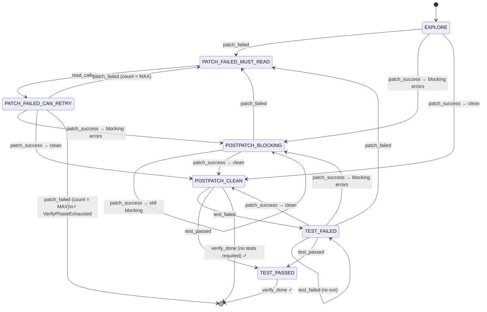

# Verify Phase State Machine — Design Spec

**Date:** 2026-05-20
**Worktree:** `feat-agentic-planning`

---

## Problem

The tool-loop verify phase is governed by five scattered boolean flags in `tools/loop.py`
(`_patch_attempted`, `_postpatch_clean`, `_verify_done`, `_must_read_before_patch`,
`_patch_fail_count`). This creates two failure modes:

1. **Model drift.** Small models are never explicitly told their current verify-phase state.
   They infer it from implicit cues (available tools, error messages) and frequently make wrong
   decisions — emitting patches when they should read, calling `verify_done` before tests pass,
   re-applying the same broken patch in a loop.

2. **Loop amplification.** Without hard enforcement, a model in the wrong state burns through
   the full tool-call budget on degenerate patterns. A 61-iteration / 65,580-token loop has been
   observed in production.

---

## Goals

- Replace the five flags with a single `VerifyPhaseStateMachine` that owns all verify-phase state.
- Tell the model its current state explicitly in the system prompt each turn (model clarity).
- Hard-enforce tool availability per state by removing absent tools from the JSON schema — the
  model cannot call what it cannot see.
- Clear the `emit_patch` dedup cache on every state transition so fresh patches are always allowed
  after context changes.

## Non-goals

- Changing the patch engine, `PostPatchAnalyzer`, or validation runner.
- Modifying the explore phase (before the first patch attempt in a step).
- Adding new tool types.

---

## Design

### States

```python
class VerifyPhaseState(str, Enum):
    EXPLORE                = "EXPLORE"
    PATCH_FAILED_MUST_READ = "PATCH_FAILED_MUST_READ"
    PATCH_FAILED_CAN_RETRY = "PATCH_FAILED_CAN_RETRY"
    POSTPATCH_BLOCKING     = "POSTPATCH_BLOCKING"
    POSTPATCH_CLEAN        = "POSTPATCH_CLEAN"
    TEST_FAILED            = "TEST_FAILED"
    TEST_PASSED            = "TEST_PASSED"
```

| State | Meaning |
|---|---|
| `EXPLORE` | Initial state. No patch applied yet. Model locates code and emits first patch. |
| `PATCH_FAILED_MUST_READ` | Last patch failed. Model must call `read_file` or `search_code` before retrying. |
| `PATCH_FAILED_CAN_RETRY` | Model has read after a patch failure. May now emit a corrected patch. |
| `POSTPATCH_BLOCKING` | Patch applied. `py_compile` or `mypy` reported blocking errors. Must fix before running tests. |
| `POSTPATCH_CLEAN` | Patch applied. No blocking static errors. Model may run tests. |
| `TEST_FAILED` | Test run returned non-zero. Model may read, patch, and re-run. |
| `TEST_PASSED` | Test run passed. Model must call `verify_done(True)`. |

Ruff failures are **advisory only** and never cause `POSTPATCH_BLOCKING`. Ruff output is shown
in the prompt as informational context.

---

### Events

```python
class VerifyPhaseEvent(str, Enum):
    PATCH_SUCCESS      = "patch_success"      # shadow write succeeded
    PATCH_FAILED       = "patch_failed"       # search text not found / apply error
    READ_CALLED        = "read_called"        # read_file or search_code dispatched
    POSTPATCH_BLOCKING = "postpatch_blocking" # py_compile/mypy errors after patch
    POSTPATCH_CLEAN    = "postpatch_clean"    # no blocking errors after patch
    TEST_PASSED        = "test_passed"        # run_command exit 0
    TEST_FAILED        = "test_failed"        # run_command non-zero
```

`PATCH_SUCCESS` fires immediately after the shadow write. The loop then runs `PostPatchAnalyzer`
synchronously and fires `POSTPATCH_BLOCKING` or `POSTPATCH_CLEAN` as a second event before
returning control to the model. The model never sees these as separate turns — both transitions
happen atomically from the loop's perspective.

---

### State transition diagram



---

### Transition table

| Current state | Event | Next state |
|---|---|---|
| `EXPLORE` | `patch_failed` | `PATCH_FAILED_MUST_READ` |
| `EXPLORE` | `postpatch_blocking` | `POSTPATCH_BLOCKING` |
| `EXPLORE` | `postpatch_clean` | `POSTPATCH_CLEAN` |
| `PATCH_FAILED_MUST_READ` | `read_called` | `PATCH_FAILED_CAN_RETRY` |
| `PATCH_FAILED_CAN_RETRY` | `patch_failed` (count < MAX) | `PATCH_FAILED_MUST_READ` |
| `PATCH_FAILED_CAN_RETRY` | `patch_failed` (count = MAX) | raises `VerifyPhaseExhausted` |
| `PATCH_FAILED_CAN_RETRY` | `postpatch_blocking` | `POSTPATCH_BLOCKING` |
| `PATCH_FAILED_CAN_RETRY` | `postpatch_clean` | `POSTPATCH_CLEAN` |
| `POSTPATCH_BLOCKING` | `patch_failed` | `PATCH_FAILED_MUST_READ` |
| `POSTPATCH_BLOCKING` | `postpatch_blocking` | `POSTPATCH_BLOCKING` (self) |
| `POSTPATCH_BLOCKING` | `postpatch_clean` | `POSTPATCH_CLEAN` |
| `POSTPATCH_CLEAN` | `test_failed` | `TEST_FAILED` |
| `POSTPATCH_CLEAN` | `test_passed` | `TEST_PASSED` |
| `POSTPATCH_CLEAN` | `verify_done` | terminal |
| `TEST_FAILED` | `patch_failed` | `PATCH_FAILED_MUST_READ` |
| `TEST_FAILED` | `postpatch_blocking` | `POSTPATCH_BLOCKING` |
| `TEST_FAILED` | `postpatch_clean` | `POSTPATCH_CLEAN` |
| `TEST_FAILED` | `test_failed` | `TEST_FAILED` (self) |
| `TEST_FAILED` | `test_passed` | `TEST_PASSED` |
| `TEST_PASSED` | `verify_done` | terminal |

Any `(state, event)` pair not in this table is a protocol error — `transition()` raises
`InvalidVerifyPhaseTransition` with the current state and event in the message.

---

### Tool availability per state

Hard-enforced by removing tools from the JSON schema before each model call. The model cannot
call a tool that is absent from the schema — no prompt-level "please don't do X" required.

| State | read / search / list | emit_patch | run_command | verify_done |
|---|:---:|:---:|:---:|:---:|
| `EXPLORE` | ✓ | ✓ | ✗ | ✗ |
| `PATCH_FAILED_MUST_READ` | ✓ | ✗ | ✗ | ✗ |
| `PATCH_FAILED_CAN_RETRY` | ✓ | ✓ | ✗ | ✗ |
| `POSTPATCH_BLOCKING` | ✓ | ✓ | ✗ | ✗ |
| `POSTPATCH_CLEAN` | ✓ | ✗ | ✓ | ✓ |
| `TEST_FAILED` | ✓ | ✓ | ✓ | ✗ |
| `TEST_PASSED` | ✓ | ✗ | ✗ | ✓ |

Notes:
- `emit_patch` is absent from `POSTPATCH_CLEAN` — once static checks pass, the model
  must either run tests or call `verify_done`. If tests expose problems, re-patching
  happens from `TEST_FAILED`. This prevents the model from silently adding more changes
  after a clean postpatch without ever validating them.
- `verify_done` is available in `POSTPATCH_CLEAN` for steps where no tests are required
  (e.g. doc edits, config changes, comment-only patches). The model can call
  `verify_done(True)` directly without running `run_command`.
- `run_command` stays available in `TEST_FAILED` so the model can re-run a narrow test
  subset after patching without waiting for a full postpatch cycle.
- Read operations (`read_file`, `search_code`, `list_directory`) are available in every
  state including `TEST_PASSED` — reading is never the wrong action.
- `emit_patch` is absent from `TEST_PASSED` because the tests already passed; re-patching
  would invalidate the result.

---

### Dedup cache policy

`_seen_patch_calls: set[tuple]` tracks argument hashes of previously attempted `emit_patch`
calls. **Only `emit_patch` is dedup-checked.** Read operations are never deduped — re-reading
the same file is harmless and necessary for model reasoning across retry cycles.

**Cache clear on transition.** Every call to `transition()` resets `_seen_patch_calls` before
entering the new state. This covers:

- After `patch_failed` → `PATCH_FAILED_MUST_READ`: cache clears. After reading, the same patch
  body can be submitted again (with corrected search text).
- After `patch_success` → `POSTPATCH_*`: cache clears. Model can patch a different location in
  the same file without the prior patch key blocking it.
- After `test_failed` → `TEST_FAILED`: cache clears. Model can re-apply a fix to the same
  location after reading test output.

**Within-state dedup.** If the model calls `emit_patch` with the same arguments twice within the
same state stay (no transition between calls), the second call is blocked. The block response
tells the model the patch was already attempted and instructs it to call `read_file` or
`search_code` before retrying. This prevents pure repetition loops when the model is stuck.
Read operations are exempt — the model may re-read the same file as many times as needed within
a state without being blocked.

---

### PATCH_FAILED_CAN_RETRY counter

`_retry_count: int` tracks how many times the cycle
`PATCH_FAILED_MUST_READ → (read) → PATCH_FAILED_CAN_RETRY → patch_failed` has completed.

- Incremented when `patch_failed` fires while `state == PATCH_FAILED_CAN_RETRY`.
- Reset to 0 on any transition that exits either `PATCH_FAILED_*` state.
- At `count == MAX_PATCH_RETRIES` (default **5**), `transition(PATCH_FAILED)` raises
  `VerifyPhaseExhausted` instead of transitioning.

The orchestrator catches `VerifyPhaseExhausted` and marks the step attempt failed, same as the
current `max_iterations` breach path.

---

### Class interface

```python
MAX_PATCH_RETRIES: int = 5


class VerifyPhaseExhausted(Exception):
    """Raised when PATCH_FAILED_CAN_RETRY exhausts MAX_PATCH_RETRIES consecutive failures."""


class InvalidVerifyPhaseTransition(Exception):
    """Raised when an event is illegal in the current state."""


class VerifyPhaseStateMachine:
    state: VerifyPhaseState
    _retry_count: int
    _seen_patch_calls: set[tuple]

    def __init__(self) -> None:
        self.state = VerifyPhaseState.EXPLORE
        self._retry_count = 0
        self._seen_patch_calls = set()

    def transition(self, event: VerifyPhaseEvent) -> VerifyPhaseState:
        """Apply event, update state, clear patch dedup cache.

        Raises:
            VerifyPhaseExhausted: when CAN_RETRY hits MAX_PATCH_RETRIES
            InvalidVerifyPhaseTransition: for any (state, event) not in the transition table
        """
        ...

    def allowed_tools(self) -> frozenset[str]:
        """Return set of tool names available in the current state.

        The loop uses this to filter the JSON schema before each model call.
        """
        ...

    def check_patch_dedup(self, patch_key: tuple) -> bool:
        """Return True if patch_key was already attempted in this state stay.

        Does NOT add to cache — call record_patch_attempt() after dispatching.
        """
        return patch_key in self._seen_patch_calls

    def record_patch_attempt(self, patch_key: tuple) -> None:
        """Add patch_key to dedup cache after dispatching emit_patch to the engine."""
        self._seen_patch_calls.add(patch_key)

    def is_terminal(self) -> bool:
        return self.state == VerifyPhaseState.TEST_PASSED

    def state_description(self) -> str:
        """Human-readable description of the current state for injection into the system prompt.

        Called once per loop turn. Tells the model exactly where it is and what it should do next.
        """
        ...
```

---

### Integration points

**`agentd/tools/loop.py`** — the only file that changes behavior:

1. Instantiate `sm = VerifyPhaseStateMachine()` at the top of each step loop.
2. Before each model call: `sm.allowed_tools()` → filter tool schema.
3. Before each model call: prepend `sm.state_description()` to the system prompt.
4. On `emit_patch` dispatch:
   - Build `patch_key = (op_type, file_path, search_text, replace_text)` tuple.
   - `sm.check_patch_dedup(patch_key)` → if True, return dedup response to model; do not call engine.
   - Else: dispatch to patch engine, `sm.record_patch_attempt(patch_key)`.
   - On engine success: `sm.transition(PATCH_SUCCESS)`, run `PostPatchAnalyzer`,
     fire `sm.transition(POSTPATCH_BLOCKING or POSTPATCH_CLEAN)`.
   - On engine failure: `sm.transition(PATCH_FAILED)` (may raise `VerifyPhaseExhausted`).
5. On `read_file` / `search_code` dispatch:
   - Fire `sm.transition(READ_CALLED)` only when `sm.state == PATCH_FAILED_MUST_READ`.
   - In all other states the read goes through without a transition event.
6. On `run_command` result: fire `sm.transition(TEST_PASSED or TEST_FAILED)`.
7. On `verify_done(True)`: loop exits (terminal check via `sm.is_terminal()`).

**Remove:** `_patch_attempted`, `_postpatch_clean`, `_verify_done`, `_must_read_before_patch`,
`_patch_fail_count` from `loop.py`.

---

## Files to create / modify

| File | Change |
|---|---|
| `agentd/tools/verify_phase_sm.py` | New — `VerifyPhaseState`, `VerifyPhaseEvent`, `VerifyPhaseStateMachine`, exception classes |
| `agentd/tools/loop.py` | Replace 5 flags with `VerifyPhaseStateMachine`; wire all event dispatch points |
| `agentd/reasoning/tool_prompts.py` | Add `state_description()` output to per-turn system prompt |

---

## Verification

1. Submit a task with a step that requires a search-replace patch on a Python file.
2. Inject a deliberate search-string mismatch — first patch should fail.
3. Log should show: `EXPLORE → PATCH_FAILED_MUST_READ` after the failure.
4. After `read_file`, log should show: `PATCH_FAILED_MUST_READ → PATCH_FAILED_CAN_RETRY`.
5. Submit the same broken patch again — dedup block log line should appear; state unchanged.
6. Submit corrected patch — `PATCH_FAILED_CAN_RETRY → POSTPATCH_*`.
7. Exhaust 5 retry cycles with a permanently broken patch — `VerifyPhaseExhausted` raised,
   step attempt marked failed.
8. With a correct patch + passing tests: full path `EXPLORE → POSTPATCH_CLEAN → TEST_PASSED → terminal`.
